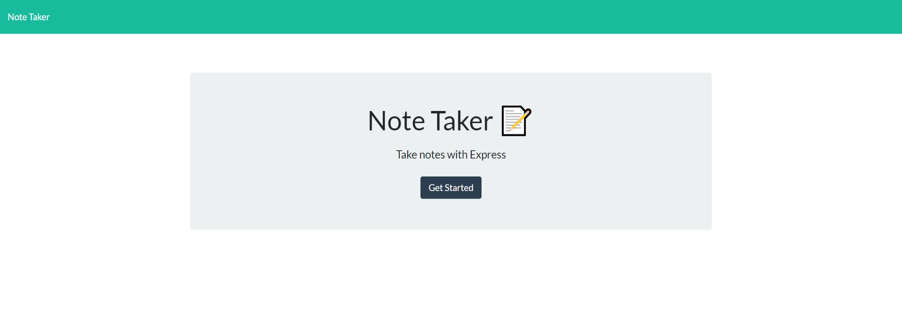
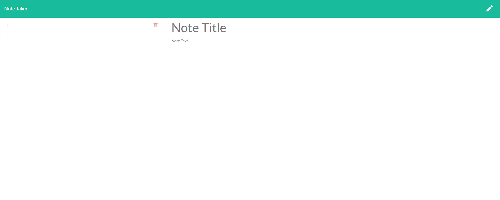

# Note Taker

  

  ## Table of Contents
   
   [ - Description](#description)
 
   [ - Installation](#installation)
 
   [ - Usage](#usage)
   
   [ - Contributing](#contributing)
   
   [ - Tests](#tests)
   
   [ - Questions](#questions)
  
   [ - License](#license)

 
   ## Description
  Note Taker is an application that takes your written input and saves it as a note for future retrieval. Future functionality development will inculde the delete function to remove notes from the list. It uses node.js, express.js and is deployed via Heroku. 

  ## Project Screenshot

  

  
  
  
  ## Installation
 The command "npm i <module>" will install any dependencies listed in package.json.
 

  ## Usage
 The purpose of this project is to create an accessible space to write your thoughts, lists, and more.
 
  
  ## Contributing
  Anyone can contribute if they wish.
 
  
  ## Tests
  N/A
  

  ## Questions
  Feel free to contact me via email, smcfarland2@gmail.com if you have any questions regarding this project. 
  Additionally, my GitHub profile is [SarahHn92](https://github.com/SarahHn92) to view more projects.

  ## License
  There is no licensing information for this project.